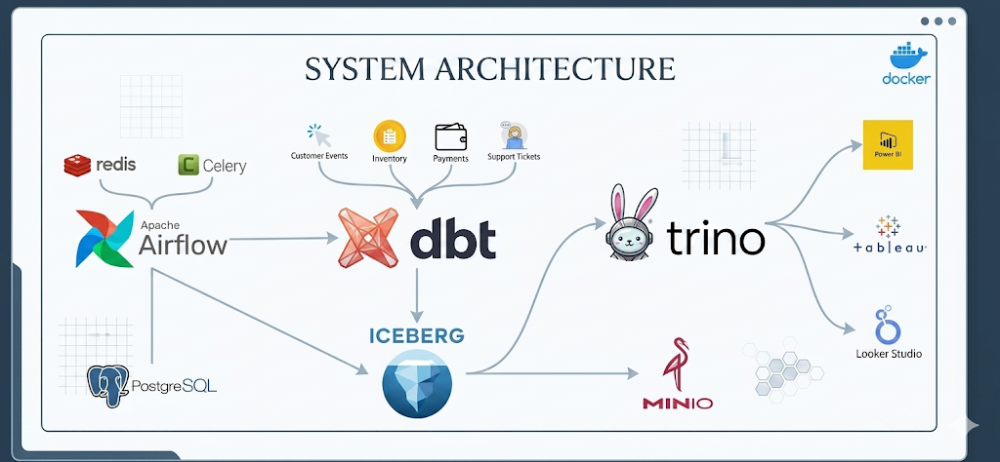
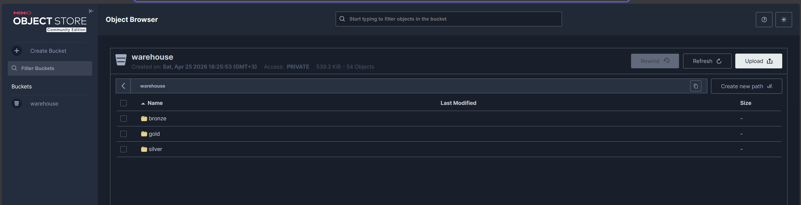
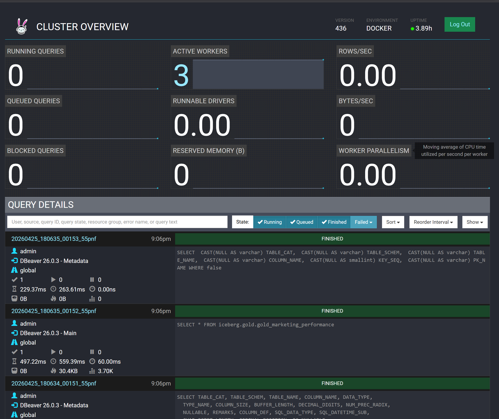
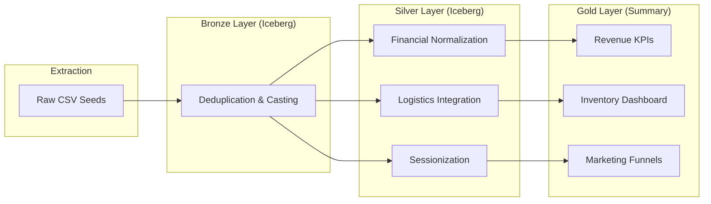
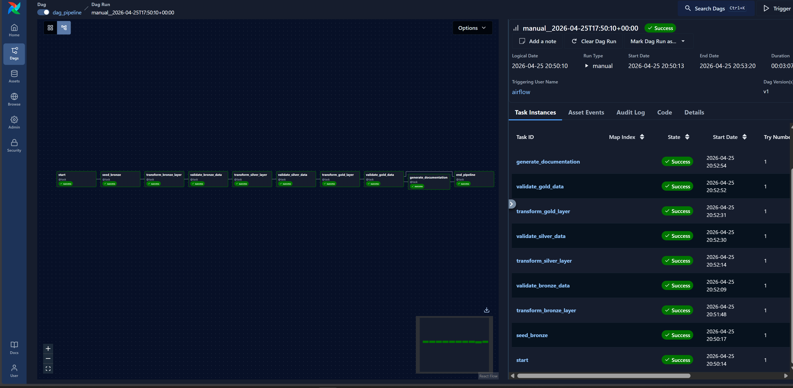
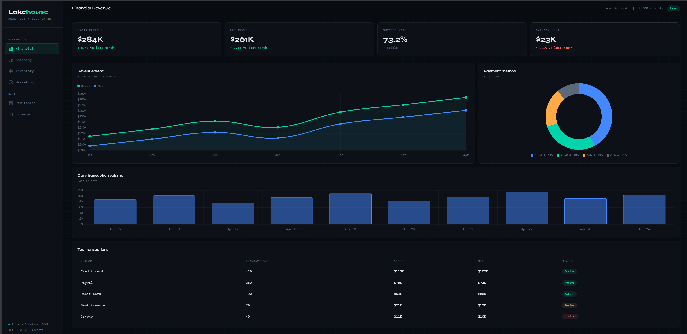
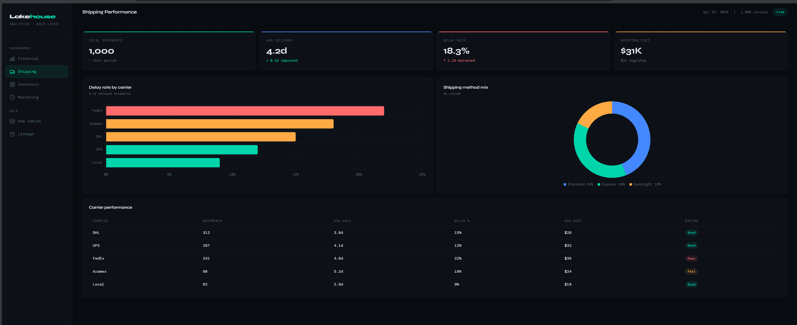
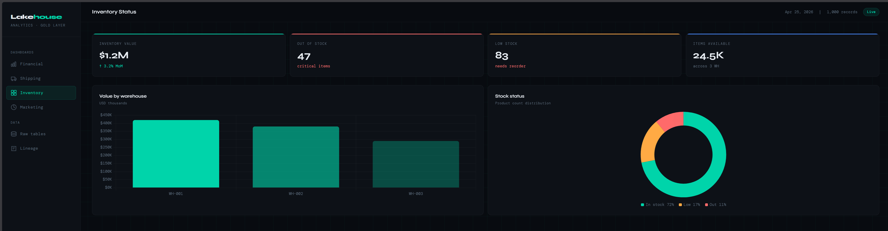
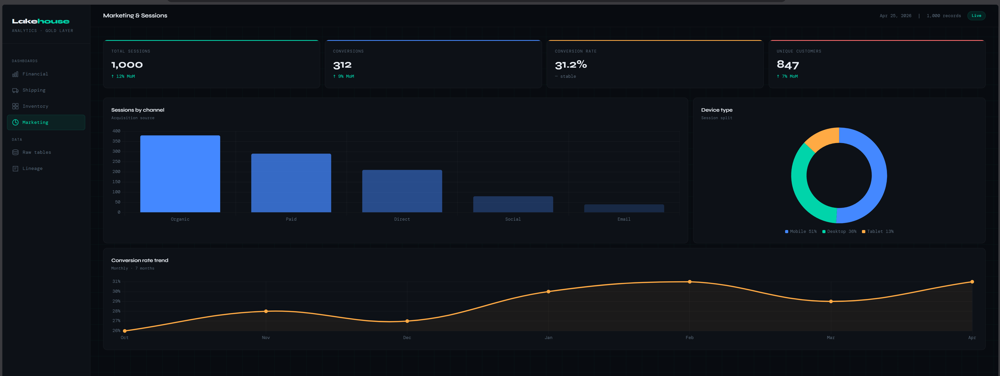

# 🏛️ Ultimate Modern Data Lakehouse: Technical Documentation
> **A High-Performance, Medallion-Architecture E-commerce Analytics Platform**



---

## 📑 Table of Contents
1. [Architecture Blueprint](#-architecture-blueprint)
2. [Service Mesh & Network Topology](#-service-mesh--network-topology)
3. [Data Flow: The Medallion Journey](#-data-flow-the-medallion-journey)
4. [Environment Configuration](#-environment-configuration)
5. [Orchestration Deep Dive](#-orchestration-deep-dive)
6. [Transformation Logic & Metrics](#-transformation-logic--metrics)
7. [UI & Reporting](#-ui--reporting)
8. [Setup & Developer Workflow](#-setup--developer-workflow)

---

## 🏗️ Architecture Blueprint
Our infrastructure is built on the principle of **Separation of Storage and Compute**. 

- **Storage Layer (MinIO):** Acts as the "Object Storage" foundation. It stores the raw `.csv` seeds and the final `.parquet` Iceberg data files.
- **Compute Layer (Trino):** A distributed SQL engine that executes queries in parallel across multiple worker nodes.
- **Catalog & Metadata (Nessie):** Serves as the "Git for Data," managing table snapshots, branches, and tags for ACID compliance.

### 📁 Infrastructure Visualization
| Storage Browser (MinIO) | Query Performance (Trino) |
| :--- | :--- |
|  |  |

---

## 🌐 Service Mesh & Network Topology

| Service | Internal Port | External Port | Role |
| :--- | :--- | :--- | :--- |
| `trino-coordinator` | `8080` | `8081` | Query parsing, planning, and UI |
| `nessie-catalog` | `19120` | `19120` | Transactional metadata management |
| `minio` | `9000/9001` | `9000/9001` | S3 API & Web Console |
| `airflow-webserver`| `8080` | `8080` | Workflow UI |
| `postgres` | `5432` | `5432` | Airflow Metadata Database |
| `redis` | `6379` | `6379` | Celery Broker for Airflow |

---

## 🌊 Data Flow: The Medallion Journey



### 1️⃣ Bronze Layer (Ingestion)
- **Logic:** We implement **Idempotent Ingestion**. Using `ROW_NUMBER()`, we ensure that even if the same record is sent multiple times, only the latest version based on `transaction_timestamp` is kept.
- **Tables:** `bronze_payment_transactions`, `bronze_customer_events`, `bronze_inventory_snapshots`.

### 2️⃣ Silver Layer (Domain Processing)
- **Logistics:** Calculates `delivery_days_taken` using `DATE_DIFF` between `shipped_at` and `actual_delivery_at`.
- **Payments:** Normalizes `gross_amount` and `net_amount` (Amount - Fees).
- **Marketing:** Groups raw events into `sessions` using a 30-minute inactivity window logic.

### 3️⃣ Gold Layer (High-Performance Aggregates)
- **Metrics:** 
  - `Conversion Rate`: `(Total Conversions / Total Sessions) * 100`
  - `Success Rate`: `(Successful Txns / Total Txns) * 100`
- **Tables:** Optimized for Joins, pre-aggregated by Date, Carrier, and Channel.

---

## 🚀 Orchestration Deep Dive: The `DbtOperator`
Unlike standard operators, our custom-built **DbtOperator** is designed for the Data Lakehouse:
- **Environment Isolation:** Executes dbt commands within the container's Python environment.
- **Fail-Fast Logic:** If a dbt model fails, the Airflow task immediately stops the downstream "Gold" layer creation to prevent data corruption.
- **Detailed Logging:** Captures full dbt output including model runtime and query IDs.



---

## 📊 UI & Reporting
The platform serves a pixel-perfect HTML/JS Dashboard that provides a multi-domain view of the business.

| Dashboard | Preview | Key KPIs |
| :--- | :--- | :--- |
| **Financials** |  | Gross Rev, Net Rev, Gateway Fees |
| **Logistics** |  | Avg Delivery Days, Delay Rate % |
| **Inventory** |  | Value/WH, Out-of-Stock count |
| **Marketing** |  | Conversion %, Sessions by Channel |

---

## 🛠️ Setup & Developer Workflow

### Environment Variables (.env)
- `AIRFLOW_UID`: 50000 (standard for local setups)
- `TRINO_USER`: admin
- `TRINO_HOST`: trino-coordinator
- `TRINO_PORT`: 8080 (internal network)

### 💻 Local Run Commands (Development)
1. **Start Stack:** `docker compose up -d`
2. **Install dbt dependencies:**
   ```bash
   docker exec -it airflow-worker bash -c "cd /opt/airflow/dags/dbt/ecommerce_dbt && dbt deps"
   ```
3. **Seed Data:**
   ```bash
   docker exec -it airflow-worker bash -c "cd /opt/airflow/dags/dbt/ecommerce_dbt && dbt seed"
   ```
4. **Run Models:**
   ```bash
   docker exec -it airflow-worker bash -c "cd /opt/airflow/dags/dbt/ecommerce_dbt && dbt run"
   ```

### 🔍 Querying historical data (Time Travel)
Because we use **Apache Iceberg**, you can query historical data without backups:
```sql
SELECT * FROM iceberg.bronze.bronze_payment_transactions 
FOR TIMESTAMP AS OF (current_timestamp - INTERVAL '1' DAY);
```

---
**Engineered to handle high-velocity data with absolute precision.**
